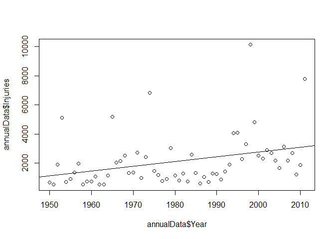
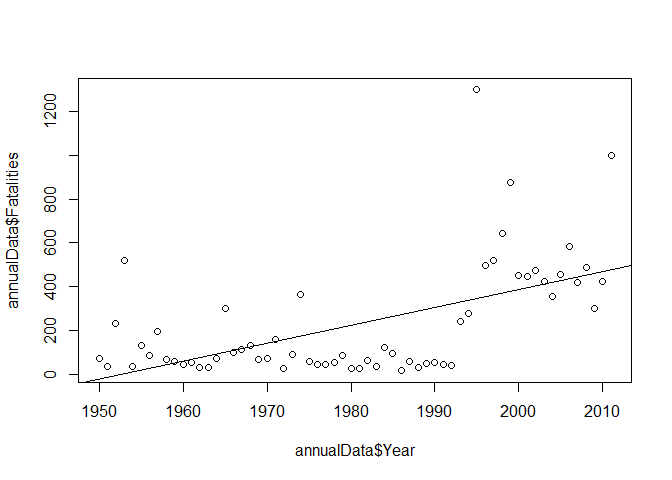
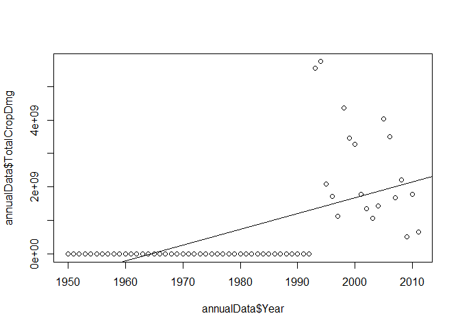

# The Effect of Severe Weather on Population Health and the Economy
Joshua Poirier

## Abstract
Across the United States, storms and severe weather events cause public health and economic problems for communities and municipalities.  These events directly result in fatalities, injuries, and property damage.  This paper will explore the United States' National Oceanic and Atmospheric Administration's (NOAA) storm database, which tracks information about severe weather events in the United States.  This information includes estimates of fatalities, injuries, and property damage.

Information tracking for severe weather began in 1950, and includes data recorded up to November 2011.  It is worth noting that in earlier years there are fewer events recorded.  This can likely be attributed to a lack of good records; more recent years can be considered complete.

## Data Source and Loading

The data used for this paper originates from the United States's NOAA storm database.  This data was supplied to the author by the organizers of Coursera course Reproducible Research (http://www.coursera.org/course/repdata).  For the purpose of this paper, assume the data has been downloaded to the working directory.  This data was downloaded from https://d396qusza40orc.cloudfront.net/repdata%2Fdata%2FStormData.csv.bz2 on December 16, 2014 at 21:55 MT.

Further information regarding this dataset can be found through the National Weather Service Storm Data Documentation (https://d396qusza40orc.cloudfront.net/repdata%2Fpeer2_doc%2Fpd01016005curr.pdf) or the National Climatic Data Center Storm Events FAQ (https://d396qusza40orc.cloudfront.net/repdata%2Fpeer2_doc%2FNCDC%20Storm%20Events-FAQ%20Page.pdf).

To start, let's set our working directory (where the downloaded data is stored), and read in the data.


```r
setwd("C:/Papers/Coursera/Reproducible Research/RepData_PeerAssessment2_Data")
stormData <- read.csv("repdata-data-StormData.csv.bz2", nrow=902297)
```

The loaded data set features the following fields:


```r
library(lubridate)
print(class(stormData))
```

```
## [1] "data.frame"
```

```r
stormData$BGN_DATE <- mdy_hms(stormData$BGN_DATE)
stormData$Year <- year(stormData$BGN_DATE)
```

temp1

```r
rawNum <- nrow(stormData)
print(names(stormData))
```

```
##  [1] "STATE__"    "BGN_DATE"   "BGN_TIME"   "TIME_ZONE"  "COUNTY"    
##  [6] "COUNTYNAME" "STATE"      "EVTYPE"     "BGN_RANGE"  "BGN_AZI"   
## [11] "BGN_LOCATI" "END_DATE"   "END_TIME"   "COUNTY_END" "COUNTYENDN"
## [16] "END_RANGE"  "END_AZI"    "END_LOCATI" "LENGTH"     "WIDTH"     
## [21] "F"          "MAG"        "FATALITIES" "INJURIES"   "PROPDMG"   
## [26] "PROPDMGEXP" "CROPDMG"    "CROPDMGEXP" "WFO"        "STATEOFFIC"
## [31] "ZONENAMES"  "LATITUDE"   "LONGITUDE"  "LATITUDE_E" "LONGITUDE_"
## [36] "REMARKS"    "REFNUM"     "Year"
```

The raw data set features XXZX severe weather event records.

## Data Processing

### Cleaning the Data
This data set is not clean.  To start, fields which will not be used during this study are removed by creating a new data frame.  This data frame will only retain relevant fields, which are described below:  


temp2

Let us also remove any records where the exponent is not *blank*, *K*, *M*, or *B* (dollars, thousands, millions, or billions of dollars respectively) for both the **PROPDGMEXP** and **CROPDMGEXP** fields.  Other values are considered to be invalid because they cannot be interpreted.

temp3

```r
## Convert fields to factor
stormData$PROPDMGEXP <- as.factor(stormData$PROPDMGEXP)
stormData$CROPDMGEXP <- as.factor(stormData$CROPDMGEXP)

## Determine if record is valid
goodPropExp <- (stormData$PROPDMGEXP == "" | stormData$PROPDMGEXP == "K" | 
                    stormData$PROPDMGEXP == "M" | stormData$PROPDMGEXP == "B")
goodCropExp <- (stormData$CROPDMGEXP == "" | stormData$CROPDMGEXP == "K" | 
                    stormData$CROPDMGEXP == "M" | stormData$CROPDMGEXP == "B")

stormData <- stormData[goodPropExp & goodCropExp,]
```


```r
propBillions <- stormData$PROPDMGEXP == "B"
propMillions <- stormData$PROPDMGEXP == "M"
propThousands <- stormData$PROPDMGEXP == "K"
propDollars <- stormData$PROPDMGEXP == ""

cropBillions <- stormData$CROPDMGEXP == "B"
cropMillions <- stormData$CROPDMGEXP == "M"
cropThousands <- stormData$CROPDMGEXP == "K"
cropDollars <- stormData$CROPDMGEXP == ""

stormData$PROP_BILLIONS <- stormData$PROPDMG * propBillions
stormData$PROP_MILLIONS <- stormData$PROPDMG * propMillions
stormData$PROP_THOUSANDS <- stormData$PROPDMG * propThousands
stormData$PROP_DOLLARS <- stormData$PROPDMG * propDollars

stormData$CROP_BILLIONS <- stormData$CROPDMG * cropBillions
stormData$CROP_MILLIONS <- stormData$CROPDMG * cropMillions
stormData$CROP_THOUSANDS <- stormData$CROPDMG * cropThousands
stormData$CROP_DOLLARS <- stormData$CROPDMG * cropDollars
```

There are a lot of crossover for event types.  The author interpreted and classified each of the permitted event types into a new field *EVENT_CLASS*.


```r
## build classification vectors
hail <- c("HAIL", "MARINE HAIL", "SMALL HAIL")
wind <- c("TSTM WIND/HAIL", "TSTM_WIND", "THUNDERSTORM WIND", "THUNDERSTORM WINDS", "HIGH WIND",
          "MARINE TSTM WIND", "MARINE THUNDERSTORM WIND", "STRONG WIND", "HIGH WINDS", "WIND",
          "STRONG WINDS", "DRY MICROBURST", "MARINE HIGH WIND", "THUNDERSTORM WINDS HAIL", 
          "GUSTY WINDS", "THUNDERSTORM WINDSS", "MARINE STRONG WIND", "THUNDERSTORM", "TSTM WIND (G45)",
          "WINDS")
tornado <- c("WATERSPOUTS", "TORNADO", "FUNNEL CLOUD", "WATERSPOUT", "DUST DEVEL", "FUNNEL CLOUDS",
             "FUNNEL")
flood <- c("FLASH FLOOD", "FLOOD", "HEAVY RAIN", "URBAN/SML STREAM FLD", "URBAN FLOODING", 
           "FLASH FLOODING", "FLOOD/FLASH FLOOD", "URBAN FLOOD", "RIVER FLOOD", "COASTAL FLOODING", 
           "FLOODING", "COASTAL FLOOD", "Coastal Flooding", "MONTHLY PRECIPITATION")
lightning <- c("LIGHTNING")
winter_precip <- c("HEAVY SNOW", "WINTER STORM", "WINTER WEATHER", "BLIZZARD", "ICE STORM", 
                   "WINTER WEATHER/MIX", "LAKE-EFFECT SNOW", "SNOW", "FREEZING RAIN", "LIGHT SNOW",
                   "MODERATE SNOWFALL", "ICE", "WINTRY MIX", "SLEET")
fire <- c("WILDFIRE", "WILD/FOREST FIRE")
drought <- c("DROUGHT", "UNSEASONABLY DRY")
heat <- c("EXCESSIVE HEAT", "HEAT", "RECORD WARMTH", "UNSEASONABLY WARM", "RECORD HEAT", "HEAT WAVE")
fog <- c("DENSE FOG", "FOG", "FREEZING FOG")
tidal_surge <- c("HIGH SURF", "TROPICAL STORM", "STORM SURGE", "HEAVY SURF/HIGH SURF",
                 "ASTRONOMICAL LOW TIDE", "HURRICANE", "STORM SURGE/TIDE", "ASTRONOMICAL HIGH TIDE",
                 "HURRICANE/TYPHOON", "HEAVY SURF", "TROPICAL DEPRESSION")
cold <- c("FROST/FREEZE", "EXTREME COLD/WIND CHILL", "EXTREME COLD", "COLD/WIND CHILL",
          "EXTREME WINDCHILL", "FREEZE", "COLD", "RECORD COLD", "FROST")
landslide <- c("LANDSLIDE")
rip_current <- c("RIP CURRENT", "RIP CURRENTS")
dust <- c("DUST STORM")
avalanche <- c("AVALANCHE")
other <- c("OTHER", "Temperature Record", "(OTHER)")

## classify each record
stormData$EVENT_CLASS <- apply(stormData, 1, FUN = function(x) {
    if (is.element(x[8], hail)) { "HAIL"
    } else if (is.element(x[8], wind)){ "WIND"
    } else if (is.element(x[8], tornado)){ "TORNADO"
    } else if (is.element(x[8], flood)){ "FLOOD"
    } else if (is.element(x[8], lightning)){ "LIGHTNING"
    } else if (is.element(x[8], winter_precip)){ "WINTER PRECIPITATION"
    } else if (is.element(x[8], fire)){ "FIRE"
    } else if (is.element(x[8], drought)){ "DROUGHT"
    } else if (is.element(x[8], heat)){ "HEAT"
    } else if (is.element(x[8], fog)){ "FOG"
    } else if (is.element(x[8], tidal_surge)){ "TIDAL SURGE"
    } else if (is.element(x[8], cold)){ "COLD"
    } else if (is.element(x[8], landslide)){ "LANDSLIDE"
    } else if (is.element(x[8], rip_current)){ "RIP CURRENT"
    } else if (is.element(x[8], dust)){ "DUST"
    } else if (is.element(x[8], avalanche)){ "AVALANCHE"
    } else if (is.element(x[8], other)){ "OTHER"
    } else "NOT CLASSIFIED"
    })

good <- stormData$EVENT_CLASS != "NOT CLASSIFIED"
stormData <- stormData[good,]
```

Create a clean data set with only the columns we are interested in:

-BGN_DATE - Beginning date of the severe weather event  
-FATALITIES - Number of fatalities resulting from the severe weather event  
-INJURIES - Number of injuries resulting from the severe weather event  
-PROPDMG - Property damage resulting from the severe weather event  
-PROPDMGEXP - Alphanumeric character describing PROPDMG field: 'K' for thousands, 'M' for millions, 'B' for billions, <blank> for dollars  
-CROPDMG - Damage to crops resulting from the severe weather event  
-CROPDMGEXP - Alphanumeric character describing CROPDMG field: 'K' for thousands, 'M' for millions, 'B' for billions, <blank> for dollars  
-STATE - State for which the severe weather event occurred  
-Year - Year for which the severe weather event took place  
-LATITUDE - Geographic latitude of the severe weather event  
-LONGITUDE - Geographic longitude of the severe weather event  


```r
## create clean data set
stormDataClean <- data.frame(EVENT_CLASS=stormData$EVENT_CLASS, BGN_DATE=stormData$BGN_DATE,
                             FATALITIES=stormData$FATALITIES, INJURIES=stormData$INJURIES,
                             PROP_BILLIONS=stormData$PROP_BILLIONS, 
                             PROP_MILLIONS=stormData$PROP_MILLIONS,
                             PROP_THOUSANDS=stormData$PROP_THOUSANDS,
                             PROP_DOLLARS=stormData$PROP_DOLLARS,
                             CROP_BILLIONS=stormData$CROP_BILLIONS,
                             CROP_MILLIONS=stormData$CROP_MILLIONS,
                             CROP_THOUSANDS=stormData$CROP_THOUSANDS,
                             CROP_DOLLARS=stormData$CROP_DOLLARS,
                             STATE=stormData$STATE, Year=stormData$Year,
                             LATITUDE=stormData$LATITUDE, LONGITUDE=stormData$LONGITUDE)
rm(stormData)
```

We have further reduced the data set from XXX records.  Valuable information could be hidden within these records; however, the author expects the major trends (and purpose of the study) to remain within the data set.

### Records throughout time

It is worth noting that the reliability of records has increased dramatically since recordkeeping began.  If the reliability of records increased dramatically at a discrete point in time, we may wish to eliminate records occurring prior to that.  The reliability of records may have changed with the implementation of new recordkeeping systems (such as computers).  To approximate this, we will examine the number of severe weather records per year.


```r
hist(stormDataClean$Year, breaks=61, col="steelblue",
     main="Histogram of Severe Weather Records' Year",
     xlab="Year")
abline(v=1993, col="red")
abline(v=2006, col="red")
text(1993, 50000, "1993")
text(2006, 50000, "2006")
```

 

The years 1993 and 2006 are highlighted as years featuring a dramatic increase in the number of records.  While climate change may result in an increase in severe weather events, it seems reasonable to assume that this would not result in such a sudden year-to-year jump.  A change in the recordkeeping system seems more likely, and we proceed with this assumption.

We also examine the number of fatalities, injuries, property damage, and crop damage on an annual basis.  This will help confirm our assumption.


```r
annualData <- aggregate(data.frame(injuries=stormDataClean$INJURIES,
                                   fatalities=stormDataClean$FATALITIES,
                                   prop_Billions=stormDataClean$PROP_BILLIONS,
                                   prop_Millions=stormDataClean$PROP_MILLIONS,
                                   prop_Thousands=stormDataClean$PROP_THOUSANDS,
                                   prop_Dollars=stormDataClean$PROP_DOLLARS,
                                   crop_Billions=stormDataClean$CROP_BILLIONS,
                                   crop_Millions=stormDataClean$CROP_MILLIONS,
                                   crop_Thousands=stormDataClean$CROP_THOUSANDS,
                                   crop_Dollars=stormDataClean$CROP_DOLLARS),                            
                        by=list(stormDataClean$Year),
                        FUN=sum)
annualData$TotalPropDmg <- annualData$prop_Billions * 1000000000 +
    annualData$prop_Millions * 1000000 +
    annualData$prop_Thousands * 1000 +
    annualData$prop_Dollars
annualData$TotalCropDmg <- annualData$crop_Billions * 1000000000 +
    annualData$crop_Millions * 1000000 +
    annualData$crop_Thousands * 1000 +
    annualData$crop_Dollars
names(annualData) <- c("Year", "Injuries", "Fatalities", "Prop_Billions", "Prop_Millions",
                       "Prop_Thousands", "Prop_Dollars", "Crop_Billions", "Crop_Millions",
                       "Crop_Thousands", "Crop_Dollars", "TotalPropDmg", "TotalCropDmg")
print(names(annualData))
```

```
##  [1] "Year"           "Injuries"       "Fatalities"     "Prop_Billions" 
##  [5] "Prop_Millions"  "Prop_Thousands" "Prop_Dollars"   "Crop_Billions" 
##  [9] "Crop_Millions"  "Crop_Thousands" "Crop_Dollars"   "TotalPropDmg"  
## [13] "TotalCropDmg"
```

```r
regInjuries <- lm(Injuries ~ Year, annualData)
plot(annualData$Year, annualData$Injuries)
abline(regInjuries)
```

 

```r
regFatalities <- lm(Fatalities ~ Year, annualData)
plot(annualData$Year, annualData$Fatalities)
abline(regFatalities)
```

 

```r
regTotalPropDmg <- lm(log(TotalPropDmg) ~ Year, annualData)
plot(annualData$Year, log(annualData$TotalPropDmg))
abline(regTotalPropDmg)
```

 

```r
regTotalCropDmg <- lm(TotalCropDmg ~ Year, annualData)
plot(annualData$Year, annualData$TotalCropDmg)
abline(regTotalCropDmg)
```

 

In order to forecast the effects of severe weather events on the populations health, and the economy, we want to examine the most reliable data.  In order to avoid biasing our forecast effects we will eliminate those records occurring prior to 2006.

temp6

```r
# good <- stormData$Year >= 2006
# stormData <- stormData[good,]
```

## The Effect of Severe Weather on Population Health


## The Economic Severe Weather of Storms

